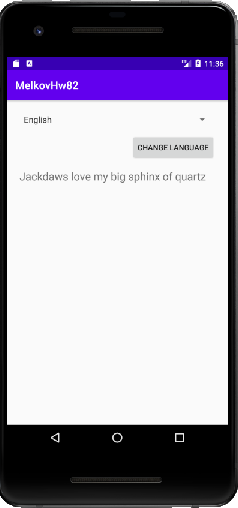

## Задача 2. Страница переключения языка.
### Описание
Если мобильное приложение выходит на международный рынок, ему нужна локализация под разные языки. Создайте страницу со следующими элементами:

Spinner со списком языков - Русский и Английский.
Кнопка ОК. По клику на данную кнопку - во всем приложении переключается язык.
Добавьте текст на странице для отображения на английском и русском.
### Реализация
Создайте директории для локализации файлов string.xml. Необходимые директории создаются из меню res->New->Android Resource Direcotry. Нужные ресурсы строк прописываем в каждом string.xml из директории каждого языка.

После выбора языка из списка Spinner-а, для данного языка, в обработчике нажатия (кнопка ОК) создаем объект класса Locale.

Например для русского:

```
Locale locale = new Locale("ru");
```
Вносим изменения в конфигурацию:

```
Configuration config = new Configuration();
config.setLocale(locale)
```

Обновляем конфигурацию:

```
getResources().updateConfiguration(config, getBaseContext().getResources().getDisplayMetrics());
```

Перезапускаем наш активити:
```
recreate();
```

В итоге получаем:

```
    @Override
    public void onClick(View v) {
        Locale locale = new Locale("ru");
        Configuration config = new Configuration();
        config.setLocale(locale);
        getResources().updateConfiguration(config, getBaseContext().getResources().getDisplayMetrics());
        recreate();
    }
```

